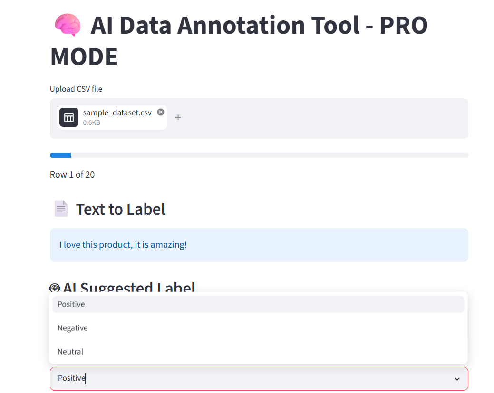
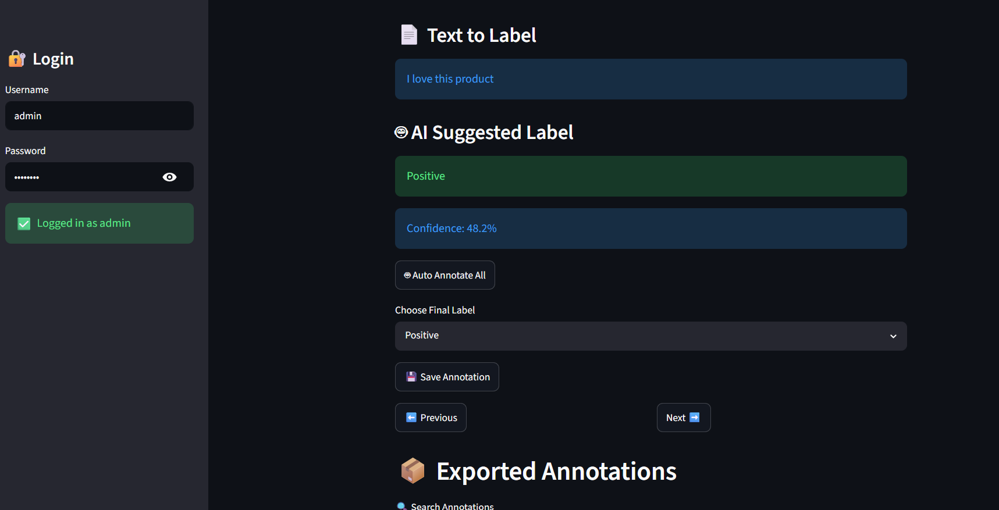
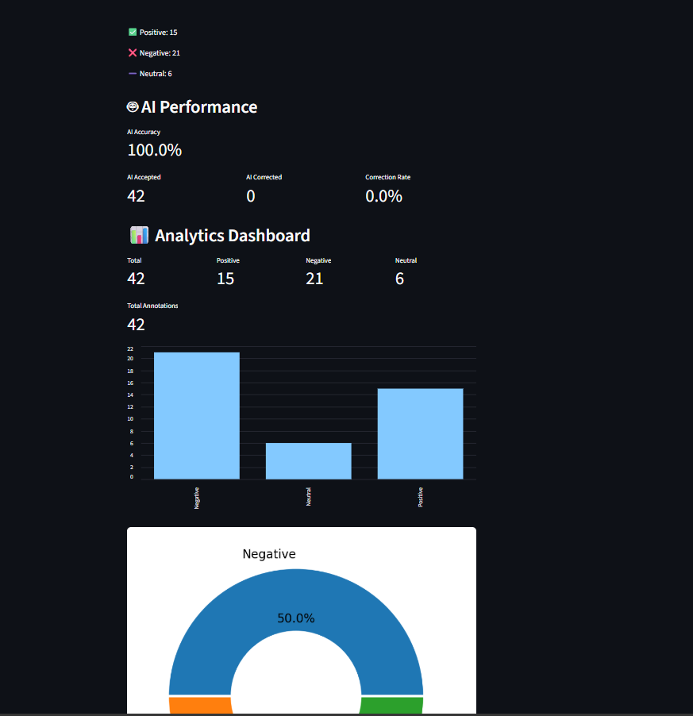
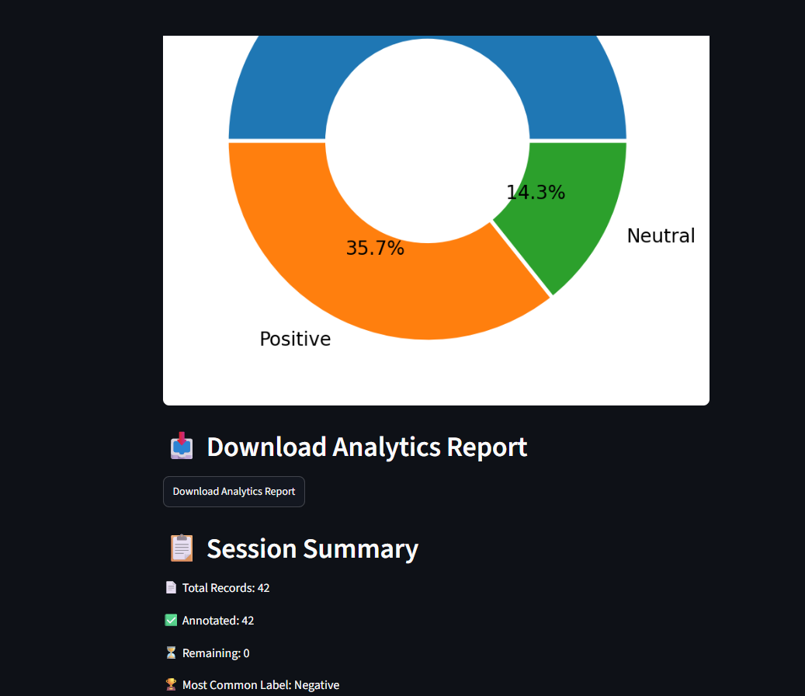

# 🧠 AI Annotation Platform

### 🔗 Live Demo

https://ai-annotation-platform-ft8tbtxyatzpxwfkchwwyp.streamlit.app/

## Overview

AI Annotation Platform is a machine learning-powered data labeling application built with Streamlit. The platform enables users to upload text datasets, receive AI-generated sentiment predictions, manually review annotations, track labeling progress, evaluate AI performance, and export labeled datasets for machine learning and NLP workflows.

---

## Features

### 🔐 Authentication

* Secure login system for controlled access

### 📂 Dataset Upload

* Upload CSV datasets for annotation

### 🤖 AI-Powered Label Suggestions

* Sentiment predictions using a trained Machine Learning model
* TF-IDF vectorization with Logistic Regression

### 📈 Confidence Scoring

* Displays model confidence for each prediction

### ⚡ Auto Annotation

* Automatically label the entire dataset using the trained model

### 📝 Manual Annotation

* Human-in-the-loop labeling workflow
* Override AI predictions when necessary

### ✏️ Annotation Editing

* Modify previously saved labels

### 🚫 Duplicate Prevention

* Prevents duplicate annotations of the same record

### 📊 Progress Tracking

* Real-time annotation progress monitoring

### 📈 Analytics Dashboard

* Label distribution metrics
* Interactive visualizations

### 🎯 AI Performance Metrics

* AI Accuracy
* AI Accepted Count
* AI Corrected Count
* Correction Rate

### 🍩 Donut Chart Visualization

* Visual representation of label distribution

### 📋 Session Summary

* Total Records
* Annotated Records
* Remaining Records
* Most Common Label

### 📦 Export Features

* Export annotated datasets to CSV
* Export analytics reports

---

## Demo Screenshots

### Login System



### Annotation Interface with AI Suggestions



### Analytics Dashboard



### AI Performance & Session Summary



---

## Tech Stack

* Python
* Streamlit
* Pandas
* Scikit-learn
* Joblib
* Matplotlib

---

## Machine Learning Pipeline

1. Text preprocessing
2. TF-IDF feature extraction
3. Logistic Regression classification
4. Confidence score generation
5. Human review and correction
6. Dataset export

---

## Installation

```bash
pip install -r requirements.txt
```

---

## Run Locally

```bash
streamlit run app.py
```

---

## Project Workflow

1. Login to the platform
2. Upload a CSV dataset
3. Review AI-generated predictions
4. Check prediction confidence scores
5. Annotate manually or use Auto Annotate
6. Edit annotations if required
7. Analyze AI performance metrics
8. Export annotated datasets and reports

---

## Future Enhancements

* Multi-user annotation system
* Role-based access control
* Active learning integration
* Model retraining from user feedback
* Support for image annotation
* Cloud database integration

---

## Author

**Vinamra Chourasia**

GitHub: https://github.com/vinamra-nexus
